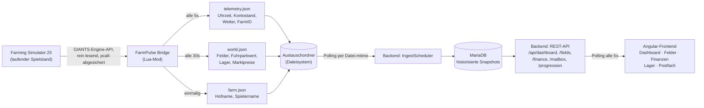

# IST-Analyse: FarmPulse

> Fachliche (funktionale) Analyse des Gesamtsystems - Bridge, Backend, Frontend.
> Bewusst **ohne** Bewertung von Code-Qualität, Architektur oder Technologiewahl;
> Gegenstand ist ausschließlich, **welche fachliche Logik heute existiert, wie sie
> funktioniert und welche Geschäftsregeln ihr zugrunde liegen**.
>
> Stand: 2026-09-17 · Branch `claude/projekt-analyse-logik-mklzmn` · Commit `f5afabd`

---

## 0. Methodik

Diese Analyse beruht auf vollständiger Durchsicht aller drei Teilsysteme
(`Bridge/`, `backend/`, `frontend/`) sowie der vorhandenen Projektdokumentation
(`README.md`, `CHANGELOG.md`, `CONTRIBUTING.md`, `Bridge/README.md`,
`backend/README.md`, `backend/docs/MOCK_DASHBOARD_DATENLUECKEN.md`). Wo eine
fachliche Regel im Code implementiert ist, wird sie hier in eigenen Worten
nachvollzogen statt zitiert - Ziel ist ein von der Implementierung unabhängig
lesbares Bild der Fachlogik.

Dieses Dokument beantwortet **"was ist heute da und wie funktioniert es
fachlich"**. Die Fortsetzung "was fehlt und was wäre sinnvoll" steht im
Begleitdokument [`Fachliche-Luecken-und-Erweiterungen.md`](./Fachliche-Luecken-und-Erweiterungen.md).

---

## 1. Was ist FarmPulse? (Fachlicher Kontext)

FarmPulse ist eine **Begleit-Anwendung zu einem laufenden Farming Simulator
25-Spielstand**. Während im Spiel selbst der Hof bewirtschaftet wird, zeigt
FarmPulse denselben Betrieb als externes "Farm-Management-Dashboard" - Kontostand,
Felder, Lagerbestände, Finanzen und ein fiktives Firmenpostfach, jeweils live
aktualisiert.

Zwei Konzepte weisen über ein reines Monitoring-Werkzeug hinaus:

- Die **"Vorgeschichte"** (Freitext-Backstory beim Start eines neuen Spielstands)
  und
- das **Firmenpostfach** mit für spätere KI-Generierung vorgesehenen Nachrichten

deuten auf einen **narrativen/rollenspielhaften Anspruch** hin: FarmPulse soll den
Hof nicht nur vermessen, sondern als Unternehmen mit eigener Geschichte
inszenieren (passend z.B. zu einem Let's Play/Rollenspiel-Kontext). Dieser
Anspruch ist im Datenmodell bereits angelegt (Backstory-Feld, Postfach-Kategorien,
Reputation/Mitarbeiterzufriedenheit/Saisonziele als "weiche" Unternehmenswerte),
wird inhaltlich aber noch nicht eingelöst (siehe Kapitel 3.9 f. sowie das
Lücken-Dokument).

Die drei Teilsysteme haben klar getrennte fachliche Rollen:

| Teilsystem | Fachliche Rolle |
|---|---|
| **Bridge** (Lua-Mod, läuft in FS25) | Datenerfassung am Ort des Geschehens - liest den Spielzustand und exportiert ihn als Momentaufnahme |
| **Backend** (Spring Boot + MariaDB) | Gedächtnis und fachliche Aufbereitung - historisiert Momentaufnahmen, leitet erste Kennzahlen ab, stellt sie über REST bereit |
| **Frontend** (Angular) | Präsentation und leichte Darstellungslogik (z.B. Statuslabels, Formatierung) |

---

## 2. Datenfluss im Überblick

**Zeittakte der fachlichen Datenerfassung/-aktualisierung:**

| Vorgang | Takt | Bemerkung |
|---|---|---|
| Bridge schreibt `telemetry.json` | 5 s | "Puls"-Werte |
| Bridge schreibt `world.json` | 30 s | Besitzstand |
| Bridge schreibt `farm.json` | einmalig bei Aktivierung | ändert sich praktisch nie |
| Backend liest `telemetry.json` | 5 s (konfigurierbar) | nur bei tatsächlicher Änderung (Datei-mtime) |
| Backend liest `world.json` | 30 s (konfigurierbar) | dito |
| Backend liest `farm.json` | 60 s (konfigurierbar) | dito |
| Postfach-Nachrichtengenerierung | 180 s (konfigurierbar) | zeitgesteuert, nicht ereignisgesteuert |
| Frontend-Polling (alle Seiten) | 5 s | unabhängig vom jeweiligen Backend-Takt |

Fachlich bedeutet das: Die "Echtzeit"-Wirkung des Dashboards entsteht durch
**Polling auf allen drei Ebenen**, nicht durch aktive Benachrichtigung. Ein
Feldkauf im Spiel kann dadurch im Frontend mit einer Verzögerung von bis zu
30-40 Sekunden sichtbar werden.

---

## 3. Fachliche Bausteine im Detail

### 3.1 Telemetrie-Erfassung (Bridge)

Erfasst die "schnellen Pulswerte" eines Betriebs: Uhrzeit, Spieltag/-monat/-jahr,
Kontostand, FarmID, aktueller Wettertyp und Temperatur.

Leitprinzip: Die Bridge **bleibt bewusst "dumm"** - sie trifft keine fachlichen
Entscheidungen, aggregiert nicht über Zeit und hält selbst keine Historie. Jeder
Export ist eine reine Momentaufnahme; die Zeitreihenbildung passiert
ausschließlich im Backend.

Bemerkenswert ist das **dokumentierte Konfidenzmodell**: Für jeden erfassten Wert
ist im Projekt hinterlegt, ob der zugrunde liegende Engine-Zugriff *bestätigt*,
*hergeleitet* oder nur ein *unbestätigter Fallback* ist (`Bridge/README.md`,
Konfidenz-Tabelle). Fachlich heißt das: **die Datenbasis selbst trägt eine
dokumentierte Unsicherheit** - z.B. kann `weatherType` dauerhaft `"UNKNOWN"`
bleiben, wenn die hergeleitete Strategie in einer FS25-Version nicht greift.

### 3.2 Welt-/Besitzstand-Erfassung (Bridge)

Erfasst, was einem Betrieb jenseits des Kontostands gehört:

- **Felder**: die komplette Farmland-Liste der Karte (nicht nur die eigenen!) -
  die fachliche Entscheidung "gehört mir" wird bewusst nicht in der Bridge,
  sondern erst in Backend/Frontend getroffen (Abgleich `ownerFarmId` gegen die
  eigene `farmId`).
- **Anbaudaten je Feld** (Fruchtart, Wachstumsstand, Ertragsprognose) - siehe 3.3.
- **Fuhrpark**: ausschließlich als **aggregierter Verkaufswert** aller
  Fahrzeuge der Farm - keine Einzelfahrzeugsicht.
- **Lagerbestände**: über alle Lagerorte hinweg (Produktionspunkte **und** frei
  platzierte Hofsilos) je Fruchtart aufsummiert - der Anwendungsfall ist "wie
  viel X habe ich insgesamt", nicht "wo genau lagert es".
- **Marktpreise je Fruchtart**: aktueller Preis sowie der höchste Preis der
  letzten 12 FS25-"Perioden" (inkl. aufgelöstem Monatsnamen).

### 3.3 Ertragsprognose-Logik

Die zentrale abgeleitete Kennzahl der Felder-Domäne. Berechnung
(`FieldCollector.computeCropInfo`, Bridge-seitig):

1. **Wachstumsfortschritt** (0 bis 1): `1.0`, falls die Frucht bereits erntereif
   ist; sonst `aktueller Wachstumsstand ÷ mindestens nötiger Wachstumsstand`
   (auf 0..1 begrenzt).
2. **Ertragsschätzung in Litern**: `Liter je m² der Fruchtart × Feldfläche in m²
   × Wachstumsfortschritt`.

Fachliche Einordnung: Dies ist eine **lineare Näherung ohne
Bonus-/Malus-Faktoren**. Das eigentliche Ingame-Ergebnis beim Dreschen
berücksichtigt zusätzlich Spritz-, Pflug-, Walz- und Unkraut-Faktoren, die hier
bewusst nicht nachgebildet werden. Die Prognose ist als Trend- bzw.
Orientierungswert zu verstehen, nicht als exakte Vorhersage.

Aus der Ertragsprognose leitet das Frontend zusätzlich einen **Status** ab
(`fieldStatus`, da FS25 selbst keine benannten Wachstumsphasen über die
Modding-API liefert):

| Bedingung | Status | Label |
|---|---|---|
| keine Fruchtart / kein Wachstumswert | `FALLOW` | „Unbewirtschaftet" |
| Wachstumsfortschritt = 0 | `SOWN` | „Gesät" |
| 0 < Wachstumsfortschritt < 1 | `GROWING` | „Wachstum" |
| Wachstumsfortschritt ≥ 1 | `READY` | „Erntereif" |

Eine feinere Phase (`fieldPhaseLabel`: „Gesät" / „Frühes Wachstum" /
„Fortgeschritten" / „Erntereif") wird zusätzlich anhand fester Schwellwerte
(0, 0,5, 1) abgeleitet.

### 3.4 Ingest & Historisierung (Backend)

Das fachliche "Gedächtnis" des Systems. Für jede der drei Austauschdateien läuft
derselbe Ablauf: **lesen, sofern seit dem letzten Mal tatsächlich verändert**
(erkannt über die Datei-Änderungszeit, nicht über einen Inhalts-Vergleich) →
optionaler Verarbeitungsschritt (aktuell reiner Durchreicher, siehe unten) →
Abbildung auf historisierte Datenbank-Zeilen.

Wichtige fachliche Regeln:

- **Jede tatsächliche Änderung erzeugt eine neue Zeile** (Zeitreihe) - es wird
  nichts überschrieben. Für `world.json` bedeutet das: da die Bridge bei jedem
  Poll die *vollständige* Feld- und Lagerliste liefert (kein Delta), wird auch
  im Backend je Snapshot die komplette Liste neu gespeichert.
- **Die FarmID kommt ausschließlich aus `telemetry.json`.** `world.json` und
  `farm.json` enthalten selbst keine FarmID. Beide werden deshalb fachlich der
  **zuletzt über `telemetry.json` gesehenen Farm** zugeordnet. Daraus folgt eine
  zentrale Geschäftsannahme: **genau ein aktiver Spielstand/eine aktive Farm
  pro Backend-Instanz.**
- **Ein Verarbeitungsschritt-Erweiterungspunkt** (`*ProcessingStep`-Interfaces)
  liegt bereits zwischen Rohdaten und Speicherung, ist aber aktuell ein reiner
  Passthrough (`NoOp*ProcessingStep`) - vorbereitet für künftige fachliche
  Veredelung (z.B. Plausibilisierung, Ableitung weiterer Kennzahlen), ohne dass
  die umgebende Ingest-Pipeline geändert werden müsste.
- Der Ingest-Pfad ist **ausschließlich zeitgesteuert**, es gibt keinen manuellen
  REST-Trigger.

### 3.5 Savegame-Onboarding

Ein neuer Spielstand gilt fachlich erst als **"gestartet"**, wenn **alle vier**
folgenden Bedingungen erfüllt sind:

1. eine "Vorgeschichte" wurde einmalig eingegeben (Freitext, 1-20.000 Zeichen),
2. `telemetry.json` wurde mindestens einmal erfolgreich gelesen,
3. `world.json` wurde mindestens einmal erfolgreich gelesen,
4. `farm.json` wurde mindestens einmal erfolgreich gelesen.

Das Frontend zeigt diese vier Schritte als Fortschrittsanzeige und leitet
automatisch zum Dashboard weiter, sobald `started = true` ist (`startedGuard`
verhindert zusätzlich den Zugriff auf das Dashboard davor,
`notStartedGuard` verhindert ein erneutes Aufrufen der Startseite danach).

Die Vorgeschichte kann bereits **vor** der ersten erkannten Farm eingegeben
werden (da Backend zu diesem Zeitpunkt noch keine FarmID kennt) und wird
automatisch nachträglich mit der Farm verknüpft, sobald diese über
`telemetry.json` erstmals angelegt wird.

Fachliche Nutzung der Vorgeschichte **heute**: ausschließlich Speicherung. Es
gibt weder eine Anzeige noch eine inhaltliche Auswertung.

### 3.6 Dashboard (Aggregationslogik)

Kombiniert den jeweils jüngsten Telemetrie- und Welt-Snapshot zu einer
Gesamtsicht: Stammdaten, Spielzeit, Wetter, Kontostand, Fuhrparkwert, eigene
Felder (gefiltert über `ownerFarmId == Farm.id`), alle Lagerbestände sowie
einen Kontostand-Verlauf für die Sparkline.

**Hinweis-/Alert-Logik**: Aktuell existiert **genau eine** Regel im gesamten
System: *Kontostand negativ → Warnung*. Es ist das einzige "vorausschauende"
bzw. warnende Element - alles andere im System ist rein beschreibend
(zeigt Ist-Zustand, bewertet ihn aber nicht).

### 3.7 Finanzen

Die Bridge liefert **keine Einzeltransaktionen**, sondern ausschließlich
Kontostand-Zeitpunkte. Einnahmen/Ausgaben werden deshalb **rückwirkend aus den
Kontostand-Deltas** zwischen aufeinanderfolgenden Telemetrie-Snapshots
rekonstruiert:

- Summe aller **positiven** Deltas über die letzten *n* Snapshots = „Einnahmen"
- Summe aller **negativen** Deltas (im Betrag) = „Ausgaben"
- *n* ist ein Datenpunkt-Limit (Default 20, maximal 200 Snapshots) - **kein**
  Kalenderzeitraum wie „diese Woche", da die Bridge keine reale Uhrzeit
  mitliefert, mit der sich so ein Zeitraum bilden ließe.

Fachliche Grenze: Diese Methode arbeitet auf **Datenpunkt-Auflösung, nicht
Ereignis-Auflösung** - finden zwischen zwei Polls mehrere Buchungen statt (z.B.
ein Feldkauf und mehrere kleinere Ausgaben), verschmelzen sie zu einem
einzigen Delta ohne erkennbaren Einzelgrund.

Bewusst **kein** invasiver Eingriff in die Spiellogik (kein Hook in
`Farm:changeBalance()`), um das Prinzip "Bridge bleibt dumm, keine Historie in
der Bridge" nicht zu verletzen.

### 3.8 Lagerbestände & Marktpreise

Je Fruchtart: Füllstand in % der Kapazität, aktueller Marktpreis sowie der
beste Preis der letzten 12 Perioden samt Zeitpunkt.

Die einzige **Bewertungslogik** des Systems liegt hier, im Frontend: Der
Bestandswert eines Lagerguts wird als `Menge × aktueller Preis je 1000 L ÷
1000` berechnet (`StorageComponent.storageValue`). Ein Füllstand ≥ 90 % wird
als „fast voll" markiert - rein visuell, ohne Rückkopplung an die zentrale
Dashboard-Hinweislogik (die frühere „Lager fast voll"-Warnung auf dem
Dashboard wurde projektseitig bewusst entfernt, siehe Kapitel 5).

### 3.9 Postfach / Firmenmailbox

Jede Nachricht besitzt Absender, Betreff, Text, eine von acht Kategorien
(`MARKET`, `EQUIPMENT`, `STAFFING`, `PAYROLL`, `WEATHER`, `AUTHORITY`, `BANK`,
`PRESS`) und eine Priorität (`HIGH`/`MEDIUM`/`LOW`).

Fachlicher Erzeugungs-Mechanismus **heute**: alle 3 Minuten wird **zufällig**
eine von acht statischen Vorlagen ausgewählt und als neue Nachricht
gespeichert - unabhängig vom tatsächlichen Spielzustand. Die einzige Kopplung
an echte Daten ist der **Zeitstempel** (die Nachricht übernimmt Spieltag/-zeit
des zuletzt gesehenen Telemetrie-Snapshots), nicht der **Inhalt**.

Die Stelle, an der künftig generierter statt vorlagenbasierter Inhalt
entstehen soll, ist im Code bereits als eigene Methode isoliert und markiert
(„TODO KI-Integration") - der Rest des Ablaufs (Farm/Spielzeit ermitteln,
Nachricht speichern) ist davon unabhängig und bleibt unverändert.

Gelesen-Status wird pro Nachricht verfolgt; Backend liefert die volle Liste
sowie eine Markierungsfunktion, Frontend bietet zusätzlich Volltextsuche und
Kategorie-/Ungelesen-Filter rein clientseitig auf der bereits geladenen Liste.

### 3.10 Progression: Reputation, Mitarbeiterzufriedenheit, Saisonziel

Drei Konzepte **ohne jede Entsprechung in FS25 selbst** - vollständig
FarmPulse-eigene Fachlogik-Idee, die den Hof zusätzlich zu den reinen
Spieldaten als "Unternehmen mit weichen Kennzahlen und Zielen" darstellen soll.

Fachlicher Ist-Zustand: Beim ersten Aufruf je Farm werden einmalig
**neutrale Platzhalterwerte** angelegt:

- Reputation = 50 %, Mitarbeiterzufriedenheit = 50 % (je Farm genau ein
  Datensatz, seitdem **nie wieder verändert**).
- Ein **zufällig** aus sechs Vorlagen gewähltes Saisonziel (z.B. „500 t Weizen
  ernten", „Kontostand von 2.000.000 € erreichen") mit `currentValue = 0`,
  ebenfalls seitdem **nie fortgeschrieben**.

Das Saisonziel ist typisiert (`MONEY_BALANCE` / `HARVEST_AMOUNT` /
`EMPLOYEE_COUNT` / `CUSTOM`), damit eine künftige Fortschrittsberechnung weiß,
welche Farm-Kennzahl sie heranziehen muss - diese Berechnung selbst existiert
noch nicht (siehe Lücken-Dokument, Kapitel 1.2, für eine differenzierte
Einschätzung je Zieltyp).

---

## 4. Datenmodell aus fachlicher Sicht

| Geschäftsobjekt | Fachliche Bedeutung | Herkunft | Verlauf? | Reifegrad |
|---|---|---|---|---|
| **Farm** | Stammdaten eines Betriebs (ID = FarmID aus dem Spiel) | `telemetry.json` (ID), `farm.json` (Name/Spieler) | nein, nur aktueller Stand | produktiv |
| **TelemetrySnapshot** | Kontostand/Spielzeit/Wetter zu einem Zeitpunkt | `telemetry.json` | ja, bei jeder Änderung (~5s-Takt) | produktiv |
| **WorldSnapshot** (+ Feld-/Lagerlisten) | Besitzstand (Felder, Fuhrpark, Lager) zu einem Zeitpunkt | `world.json` | ja, bei jeder Änderung (~30s-Takt), volle Liste je Snapshot | produktiv; Ertragsprognose als bewusste Näherung |
| **SavegameBackstory** | Freitext-Vorgeschichte eines Spielstands | Nutzereingabe | nein, einmalig | nur Speicherung, keine Auswertung |
| **MailboxMessage** | Postfach-Nachricht | Zufallsauswahl aus 8 Vorlagen | ja, fortlaufend (append-only) | Mock-Inhalte, KI-Anbindung vorbereitet |
| **FarmValues** | Reputation / Mitarbeiterzufriedenheit | Platzhalter (50 %/50 %) | nein, einmalig gesetzt | reiner Platzhalter |
| **SeasonGoal** | Saisonziel mit Fortschritt | Zufallsauswahl aus 6 Vorlagen | Statuswechsel vorgesehen (ACTIVE/COMPLETED/FAILED), aber nicht angesteuert | reiner Platzhalter |

Bewusst **kein** Fremdschlüssel: `ownerFarmId` auf Feldern ist absichtlich kein
Foreign Key auf `Farm` - die Bridge liefert **alle** Felder der Karte,
einschließlich unbesessener (`ownerFarmId = 0`) und solcher anderer,
hier nicht weiter verfolgter Farmen. Die fachliche Filterung "gehört mir"
passiert erst zur Abfragezeit in den jeweiligen Services.

---

## 5. Bewusste fachliche Scope-Entscheidungen

Ein bemerkenswerter Zug des Projekts: Mehrere naheliegende Datenpunkte fehlen
**nicht aus Versehen**, sondern wurden im Projekt explizit gegen eine Abbildung
entschieden. Das ist fachlich relevant, weil es die heutige Systemgrenze
erklärt und von echten Lücken unterscheidet:

| Bereich | Entscheidung | Dokumentierte Begründung |
|---|---|---|
| Fahrzeugzustand (Tankfüllung, Verschleiß) | nicht exportiert | Spieler beobachtet dies ohnehin selbst im laufenden Spiel |
| Server-/Sitzungsinfo (Servername, Ping, Spieleranzahl) | bewusst **nicht** umgesetzt | expliziter Projektwunsch: „das waren nur Mock-Sachen" |
| Einzeltransaktionen (Finanzen) | nicht umgesetzt | hätte die Bridge vom reinen Zustands-Exporteur zu einem zustandsbehafteten Event-Logger gemacht - architektonisch bewusst vermieden |
| Tiere/Viehwirtschaft | nicht abgebildet | konsequent aus dem Prinzip „Bridge bleibt dumm, exportiert nur das fachlich Nötige" |
| Verträge/Missionen | nicht abgebildet | laut Projektdokumentation soll dies **vollständig vom Backend** übernommen werden, nicht die Ingame-Logik spiegeln - bislang nicht begonnen |
| Kredite/Schulden | nicht abgebildet | dieselbe Begründung wie Verträge/Missionen - explizit als künftige Backend-Aufgabe benannt, bislang nicht begonnen |
| Mehrere gleichzeitige Höfe/Spielstände | nicht unterstützt | Architektur geht von genau einer Bridge-Instanz je Backend-Instanz aus |

---

## 6. Reifegrad je fachlichem Modul

| Modul | Einschätzung |
|---|---|
| Telemetrie-Erfassung (Zeit/Kontostand/Wetter) | **Produktiv** - vollständig historisiert, Konfidenz dokumentiert |
| Felder/Besitzstand | **Produktiv** - inkl. Ertragsprognose als bewusste Näherung |
| Lagerbestände/Marktpreise | **Produktiv** - Bewertungslogik (Bestandswert) vorhanden |
| Finanzen (Einnahmen/Ausgaben) | **Funktionale Näherung** - technisch korrekt, fachlich grobkörnig (keine Kategorisierung) |
| Savegame-Onboarding | **Produktiv**, aber fachlich einseitig (Vorgeschichte wird nur gespeichert, nicht genutzt) |
| Postfach | **Mock-Stufe** - Mechanik produktiv, Inhalte ohne Fachbezug zum echten Zustand |
| Progression (Reputation/Zufriedenheit/Saisonziel) | **Platzhalter** - Datenmodell vollständig, Berechnungslogik nicht begonnen |
| Alerts/Hinweise | **Minimal** - eine einzige Regel im gesamten System |
| Fuhrpark (Einzelsicht) | **Nicht begonnen** - nur Summenwert |
| Kredite/Schulden, Verträge/Missionen, Tiere | **Nicht begonnen** |

---

## 7. Kurzfazit

FarmPulse hat heute eine **solide, gut dokumentierte deskriptive Basis**: Der
Weg vom Spielzustand über eine bewusst "dumme" Bridge bis zu historisierten,
über REST abrufbaren Kennzahlen funktioniert durchgängig und mit
nachvollziehbarer Konfidenzeinschätzung je Datenpunkt - ungewöhnlich sorgfältig
für ein auf reverse-engineerten Modding-Schnittstellen basierendes System.

Die **abgeleitete/bewertende Schicht darüber ist dagegen sehr dünn**: Von
"echter" Fachlogik existiert im Kern nur die Ertragsprognose-Formel und die
Bestandswert-Berechnung im Lager; die einzige Warnregel des gesamten Systems
ist ein negativer Kontostand. Mehrere fachlich zentrale Konzepte - Reputation,
Mitarbeiterzufriedenheit, Saisonziele, die KI-Anbindung des Postfachs - sind
bereits **vollständig im Datenmodell angelegt und über die REST-Schnittstelle
sichtbar, aber ohne jede dahinterliegende Berechnungs- oder Erzeugungslogik**.
Das macht sie zum naheliegendsten Ansatzpunkt für die nächsten fachlichen
Ausbaustufen (siehe Begleitdokument).

Ebenso aufschlussreich sind die **bewusst dokumentierten Auslassungen**
(Kapitel 5): Sie zeigen, dass das Projekt seinen fachlichen Umfang bislang
sehr diszipliniert und absichtsvoll eng gehalten hat, statt unreflektiert zu
wachsen - eine gute Ausgangslage für eine geplante, priorisierte Erweiterung
statt einer nachträglichen Aufräumaktion.
